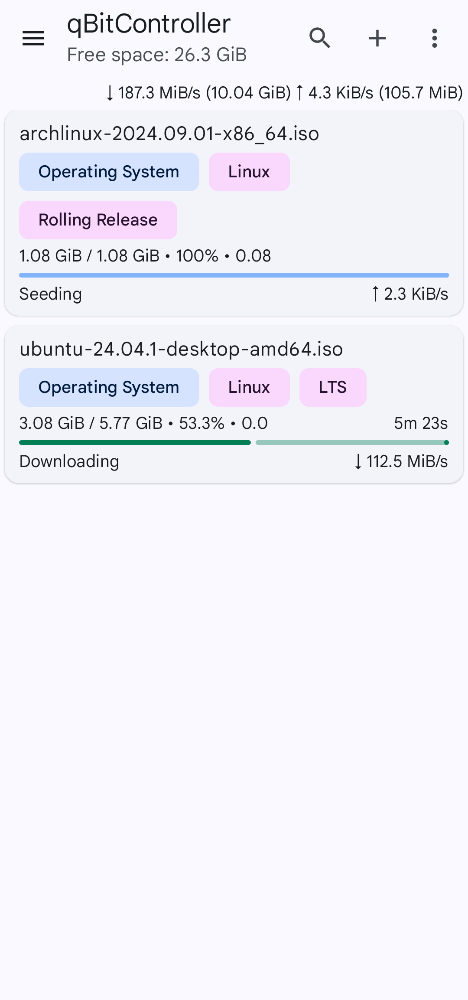
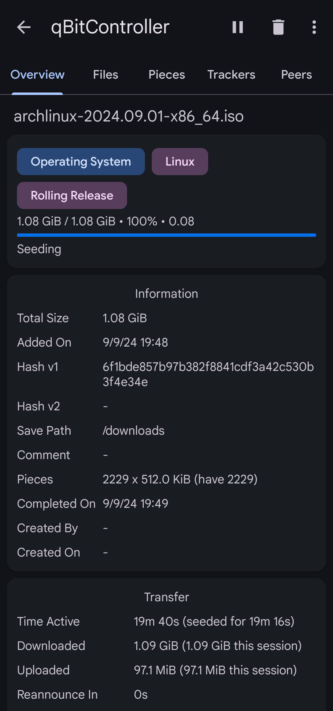

# qBitController

qBitController is a free and open-source app for
controlling [qBittorrent](https://github.com/qbittorrent/qBittorrent) from an Android device.

## Download

## Screenshots

Light

Dark

